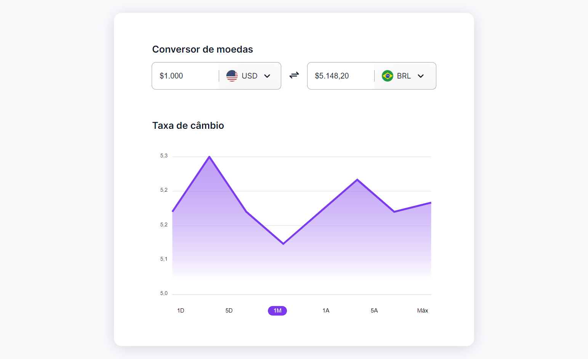
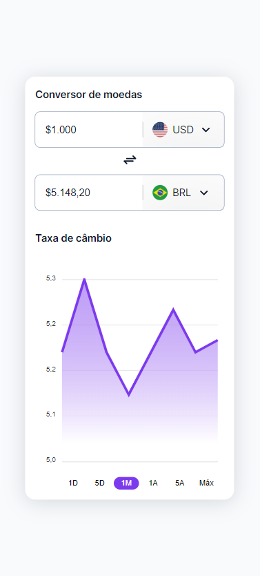

<h1 align='center'>Currency</h1>

A Currency converter challenge of Rocketseat. In this app I am using HTML, CSS, JavaScript, Apex Charts and Flag Icons. Only the graph is functional.

## Features Developed

- [x] Interaction on the graph when the mouse hovers
- [x] Responsivity

## Screenshots

The interface

Mobile version

## Prototype

You can access the Rocketseat prototype by clicking the button below.

## Technologies

## Services Used

</a>

## Deploy

You can access the project by clicking the button below.

